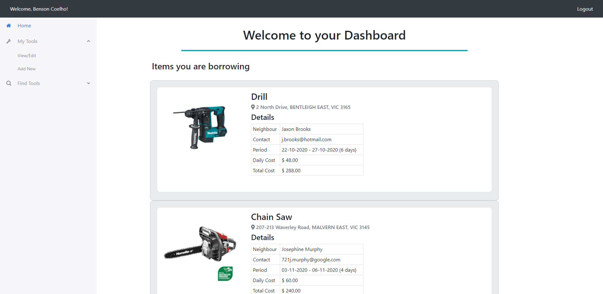
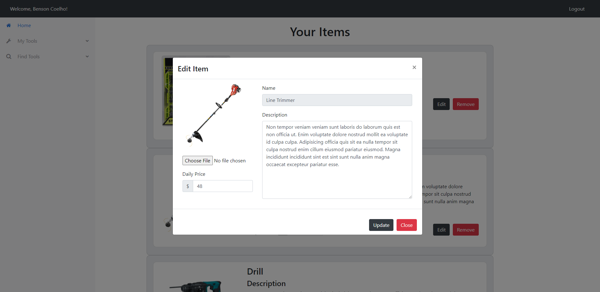

# Welcome to Howdy Neighbour!

## Table of Contents

- [Description](#Description)
- [Demonstration](#Demonstration)
- [Setup](#Setup)
- [Usage](#Usage)
- [License](#License)
- [Contributions](#Contributions)
- [Version](#Version)
- [Tests](#Tests)
- [Questions](#Questions)

## Description

An application that allows neighbours to share their tools and gardening equipment with each other. Users can list items that they own, but use infrequently with other users near them. I thought of the concept as a first time home owner who found that the list tools required for home and garden upkeep was endless. Good quality tools don't come cheap and if purchased for home use, many don't get used more than a couple of times a year. Enabling users to share these at a reasonable cost would offset some of the purchase cost and space constraints involved in owning them. In addition, the app could help increase personal interaction and building ties with your neighbours and community.

## Demonstration

Access the live application here: https://mysterious-inlet-60468.herokuapp.com/.

#### Screenshot

##### Home Page

##### Edit Page

## Setup

To install locally, clone the repository and then run `npm i` to install required packages. To run the application, run `npm start`. The live application can be accessed using the link provided above. No installation is necessary for this.

## Usage

You can add items using the Add New menu under the menu item `My Tools`. View or edit your items under `View/Edit` under the same menu item. You can find items to borrow from `Find Tools` by selecting a category and item, and entering the maximum distance that your are willing to travel.

## License

This project is made public for academic purposes only. Use of any content in this repository for any purpose other than not-for-profit academic use is not permitted without the written consent of the owner. This project contains resources including but not limited to software code from third parties. Those resources may only be used under the resource owner's license conditions.

## Contributions

I would love to hear about improvements or enhancements. Please refer to the contact details below if you have suggestions or wish to collaborate.

## Version

## Tests

No tests available currently.

## Questions

If you have further questions or would like to see more features, please contact me via github or email:

https://github.com/bdcoelho

ben_coelho@hotmail.com
